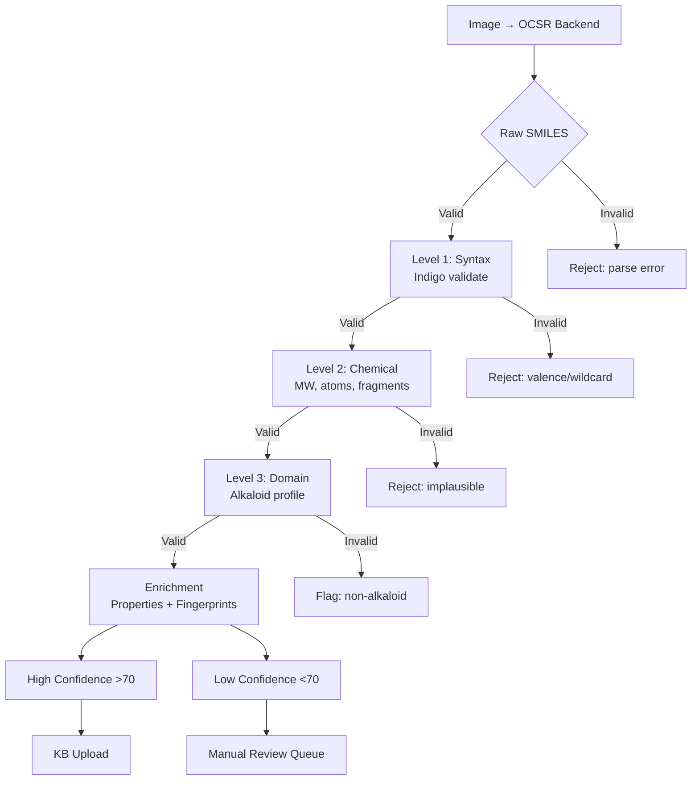

# SMILES Pipeline: Structural Blueprint

**Version:** 1.0.0
**Date:** 2026-02-25
**Status:** Architecture Review

---

## 1. Executive Summary

This blueprint defines the complete architecture for the SMILES molecular extraction pipeline, integrating OCSR backends, validation layers, and RAG knowledge base generation. Designed for ethnopharmacological research on **Sceletium tortuosum** and related South African medicinal plants.

**Key Design Principles:**
1. **Modular** - Each component independently swappable
2. **Validated** - Multi-layer quality gates (syntax → chemistry → domain)
3. **Traceable** - Full provenance from image → extraction → KB
4. **Research-Grade** - Optimized for natural product alkaloids (200-500 Da)

---

## 2. System Architecture

```
┌─────────────────────────────────────────────────────────────────────────┐
│                        SMILES PIPELINE ARCHITECTURE                     │
├─────────────────────────────────────────────────────────────────────────┤
│                                                                         │
│  ┌──────────────┐     ┌──────────────────────────────────────────────┐ │
│  │   INPUT      │     │            EXTRACTION LAYER                   │ │
│  │   SOURCES    │     │                                               │ │
│  │              │     │  ┌──────────┐  ┌──────────┐  ┌──────────┐    │ │
│  │  PDF Papers  │────▶│  │MolScribe │  │ DECIMER  │  │ MolVec   │    │ │
│  │  (129 total) │     │  │(Primary) │  │(Fallback)│  │(CPU)     │    │ │
│  │              │     │  └────┬─────┘  └────┬─────┘  └────┬─────┘    │ │
│  │  Images:     │     │       │            │            │           │ │
│  │  - Figures   │     │       └────────────┼────────────┘           │ │
│  │  - Schemes   │     │                     ▼                         │ │
│  │  - Reactions │     │         ┌─────────────────────┐              │ │
│  └──────────────┘     │         │  Raw Extractions    │              │ │
│                       │         │  (JSON per image)   │              │ │
│                       │         └──────────┬──────────┘              │ │
│                       └────────────────────┼──────────────────────────┘ │
│                                            │                             │
│                                            ▼                             │
│                       ┌──────────────────────────────────────────────┐  │
│                       │           VALIDATION LAYER                    │  │
│                       │                                               │  │
│                       │  ┌─────────────────────────────────────────┐  │  │
│                       │  │  Level 1: Syntax Validation (Indigo)    │  │  │
│                       │  │  - SMILES parseability                  │  │  │
│                       │  │  - Canonicalization                     │  │  │
│                       │  │  - Valence checking                     │  │  │
│                       │  └─────────────────┬───────────────────────┘  │  │
│                       │                    │                          │  │
│                       │  ┌─────────────────▼───────────────────────┐  │  │
│                       │  │  Level 2: Chemical Plausibility         │  │  │
│                       │  │  - MW: 100-800 Da                       │  │  │
│                       │  │  - Atoms: 5-150                         │  │  │
│                       │  │  - Fragments: ≤3                        │  │  │
│                       │  │  - Reject garbage (C.C.C, wildcards)    │  │  │
│                       │  └─────────────────┬───────────────────────┘  │  │
│                       │                    │                          │  │
│                       │  ┌─────────────────▼───────────────────────┐  │  │
│                       │  │  Level 3: Domain Validation             │  │  │
│                       │  │  - Alkaloid profile (N-containing)      │  │  │
│                       │  │  - Sceletium scaffold match             │  │  │
│                       │  │  - Stereochemistry presence             │  │  │
│                       │  │  - Against 7 gold-standard alkaloids    │  │  │
│                       │  └─────────────────┬───────────────────────┘  │  │
│                       │                    │                          │  │
│                       └────────────────────┼──────────────────────────┘  │
│                                            │                             │
│                                            ▼                             │
│                       ┌──────────────────────────────────────────────┐  │
│                       │          ENRICHMENT LAYER                    │  │
│                       │                                               │  │
│                       │  - Compute properties (MW, LogP, TPSA, etc.) │  │
│                       │  - Generate fingerprints (ECFP4, MACCS)      │  │
│                       │  - Detect scaffolds (Mesembrine-like?)       │  │
│                       │  - Assign confidence scores (0-100)          │  │
│                       │  - Cross-reference ground truth              │  │
│                       └────────────────────┬─────────────────────────┘  │
│                                            │                             │
│                                            ▼                             │
│                       ┌──────────────────────────────────────────────┐  │
│                       │          OUTPUT LAYER                        │  │
│                       │                                               │  │
│                       │  ┌───────────────┐    ┌──────────────────┐   │  │
│                       │  │ molecules.jsonl│    │ QA Report (JSON) │   │  │
│                       │  │ (all validated)│    │ - Stats per paper│   │  │
│                       │  └───────┬───────┘    │ - Backend accuracy│   │  │
│                       │          │            │ - Property dist.  │   │  │
│                       │          │            └──────────────────┘   │  │
│                       │          │                                    │  │
│                       │  ┌───────▼────────────────────────────────┐  │  │
│                       │  │     OpenWebUI Knowledge Base           │  │  │
│                       │  │  - Markdown format (human-readable)    │  │  │
│                       │  │  - JSONL format (machine-parseable)    │  │  │
│                       │  │  - Fingerprint index (similarity search)│  │  │
│                       │  └────────────────────────────────────────┘  │  │
│                       └──────────────────────────────────────────────┘  │
│                                                                         │
└─────────────────────────────────────────────────────────────────────────┘
```

---

## 3. Component Specifications

### 3.1 Input Sources

**Directory:** `data/extractions/{paper_id}/_assets/{doc_id}/images/`

**Expected:**
- 5-15 chemical structure images per paper
- Mix of single molecules, reactions, multi-panel figures
- JPEG/PNG format, 300-600 DPI typical

**Image Classification (Pre-filtering):**
```python
# Before OCSR, classify image type
IMAGE_TYPES = {
    'single_molecule': 0.70,  # 70% of images - route to MolScribe
    'reaction': 0.10,         # 10% - route to RxnScribe
    'multi_structure': 0.15,  # 15% - segment first, then OCSR
    'non_chemical': 0.05,     # 5% - skip
}
```

---

### 3.2 Extraction Layer

#### Primary Backend: MolScribe (MIT)

**Configuration:**
```yaml
molscribe:
  version: 1.1.1
  license: MIT (commercial-safe)
  model: swin_base_char_aux_1m.pth
  device: cuda  # fallback to cpu
  batch_size: 32
  inference_time: 0.1-0.3s/image (GPU)
  accuracy:
    single_molecule_f1: 0.93
    stereochemistry_preservation: 0.85-0.90
```

**Installation:**
```bash
pip install MolScribe
# Auto-downloads model weights (~100MB)
```

**API:**
```python
from molscribe import MolScribe

predictor = MolScribe.from_pretrained('swin_base_char_aux_1m.pth')
result = predictor.predict_image(image_path)
# Returns: {'smiles': '...', 'confidence': 0.95, 'graph': ...}
```

---

#### Fallback Backend: DECIMER 2.2 (FSU Jena)

**Configuration:**
```yaml
decimer:
  version: 2.2
  license: CC BY 4.0 (requires attribution)
  model: vit_base
  device: cuda  # fallback to cpu
  batch_size: 16
  inference_time: 0.2-0.5s/image (GPU)
  accuracy:
    single_molecule_f1: 0.91
    stereochemistry_preservation: 0.80-0.85
  components:
    - DECIMER_Segmentation (Mask R-CNN)
    - DECIMER_Classifier (chemical vs non-chemical)
    - DECIMER_Transformer (ViT + T5 decoder)
```

**Installation:**
```bash
pip install decimer
# Requires ~500MB model weights
```

---

#### CPU Fallback: MolVec (NIH NCATS)

**Configuration:**
```yaml
molvec:
  version: 0.9.7
  license: Apache 2.0 (commercial-safe)
  device: cpu
  inference_time: 0.05s/image
  accuracy:
    single_molecule_f1: 0.72
    multi_structure: 0.66  # best among all tools
```

**Use case:** GPU unavailable, or multi-structure images

---

### 3.3 Validation Layer

#### Level 1: Syntax Validation (Indigo Toolkit)

**Why Indigo:** Provides canonicalization **with stereochemistry preservation** - RDKit sometimes loses this.

**Validation Rules:**
```python
INDIGO_VALIDATION_RULES = {
    'must_parse': True,  # Indigo.loadSMILES() must succeed
    'no_wildcards': True,  # No '*' atoms (unless R-group paper)
    'not_placeholder': True,  # Reject "n/a", "unknown", etc.
    'valence_valid': True,  # All atoms satisfy valence rules
}
```

**Code:**
```python
from indigo import Indigo

class IndigoValidator:
    def __init__(self):
        self.indigo = Indigo()

    def validate_syntax(self, smiles: str) -> dict:
        """Level 1: Syntax validation."""
        result = {
            'is_valid': False,
            'canonical_smiles': None,
            'error': None,
        }

        # Check garbage patterns
        if smiles.lower() in ['n/a', 'unknown', 'failed', '']:
            result['error'] = 'placeholder_value'
            return result

        # Attempt parsing
        try:
            mol = self.indigo.loadSMILES(smiles)
            result['canonical_smiles'] = mol.canonicalSmiles()  # Iso SMILES
            result['is_valid'] = True

            # Check for wildcards
            if '*' in smiles:
                result['wildcard_count'] = smiles.count('*')
                if result['wildcard_count'] > 2:
                    result['is_valid'] = False
                    result['error'] = 'too_many_wildcards'

        except Exception as e:
            result['error'] = f'parse_error: {str(e)}'

        return result
```

---

#### Level 2: Chemical Plausibility (RDKit + Indigo)

**Validation Rules:**
```python
CHEMICAL_PLAUSIBILITY_RULES = {
    # Hard rejection (INVALID)
    'min_mw': 100,          # Da - reject extraction artifacts
    'max_mw': 1000,         # Da - reject combined structures
    'min_atoms': 5,         # Exclude tiny fragments
    'max_atoms': 200,       # Exclude OCSR errors
    'max_fragments': 5,     # Disconnected parts (salts ok)

    # Soft flags (WARNING)
    'warn_min_mw': 150,     # Flag small molecules for review
    'warn_max_mw': 800,     # Flag large natural products
    'warn_max_fragments': 3, # Flag mixtures
    'require_nitrogen_for_alkaloids': True,  # Context-specific
}
```

**Code:**
```python
from rdkit import Chem
from rdkit.Chem import Descriptors, rdMolDescriptors

def validate_chemical_plausibility(mol: Chem.Mol, smiles: str) -> dict:
    """Level 2: Chemical plausibility checks."""
    result = {
        'is_valid': True,
        'warnings': [],
        'rejection_reason': None,
        'properties': {},
    }

    # Compute properties
    mw = Descriptors.MolWt(mol)
    num_atoms = mol.GetNumHeavyAtoms()
    num_frags = len(Chem.GetMolFrags(mol, asMols=True))

    result['properties'] = {
        'molecular_weight': mw,
        'num_atoms': num_atoms,
        'num_fragments': num_frags,
    }

    # Hard rejections
    if mw < CHEMICAL_PLAUSIBILITY_RULES['min_mw']:
        result['is_valid'] = False
        result['rejection_reason'] = f'mw_too_low: {mw:.1f} Da'

    if mw > CHEMICAL_PLAUSIBILITY_RULES['max_mw']:
        result['is_valid'] = False
        result['rejection_reason'] = f'mw_too_high: {mw:.1f} Da'

    if num_atoms > CHEMICAL_PLAUSIBILITY_RULES['max_atoms']:
        result['is_valid'] = False
        result['rejection_reason'] = f'too_many_atoms: {num_atoms}'

    if num_frags > CHEMICAL_PLAUSIBILITY_RULES['max_fragments']:
        result['is_valid'] = False
        result['rejection_reason'] = f'too_many_fragments: {num_frags}'

    # Check for "C.C.C" garbage
    if set(smiles.replace('.', '')) <= set('C'):
        result['is_valid'] = False
        result['rejection_reason'] = 'carbon_only_garbage'

    # Soft warnings
    if mw < CHEMICAL_PLAUSIBILITY_RULES['warn_min_mw']:
        result['warnings'].append(f'mw_below_typical: {mw:.1f} Da')

    if num_frags > CHEMICAL_PLAUSIBILITY_RULES['warn_max_fragments']:
        result['warnings'].append(f'multiple_fragments: {num_frags}')

    return result
```

---

#### Level 3: Domain Validation (Ethnopharmacology-Specific)

**Validation Rules:**
```python
DOMAIN_VALIDATION_RULES = {
    'sceletium_alkaloids': {
        'expected_mw_range': (250, 400),    # Mesembrine-type
        'require_nitrogen': True,            # All alkaloids contain N
        'require_methoxy_groups': True,      # 3,4-dimethoxy pattern
        'expected_ring_count': (2, 5),       # Fused ring systems
        'require_stereochemistry': True,     # Natural = single enantiomer
    },
    'gold_standard_comparison': {
        'similarity_threshold': 0.7,  # Tanimoto for scaffold match
        'reference_molecules': [
            'mesembrine', 'mesembrenone', 'mesembrenol',
            'sceletium_a4', 'tortuosamine'
        ]
    }
}
```

**Code:**
```python
def validate_ethnopharmacology_domain(mol: Chem.Mol) -> dict:
    """Level 3: Domain-specific validation for Sceletium alkaloids."""
    result = {
        'is_valid': True,
        'compound_class': 'unknown',
        'matches_sceletium_scaffold': False,
        'gold_standard_matches': [],
        'warnings': [],
    }

    # Check for nitrogen (alkaloid requirement)
    nitrogen_count = sum(1 for a in mol.GetAtoms() if a.GetSymbol() == 'N')
    if nitrogen_count == 0:
        result['compound_class'] = 'non_alkaloid'
        result['warnings'].append('No nitrogen - not an alkaloid')
    else:
        result['compound_class'] = 'alkaloid'

    # Check for methoxy groups (Sceletium hallmark)
    methoxy_smarts = 'COc'
    methoxy_pattern = Chem.MolFromSmarts(methoxy_smarts)
    methoxy_matches = len(mol.GetSubstructMatches(methoxy_pattern))

    if methoxy_matches > 0:
        result['methoxy_count'] = methoxy_matches
        if methoxy_matches >= 2:
            result['matches_sceletium_scaffold'] = True
    else:
        result['warnings'].append('No methoxy groups detected')

    # Check MW range for Sceletium alkaloids
    mw = Descriptors.MolWt(mol)
    min_mw, max_mw = DOMAIN_VALIDATION_RULES['sceletium_alkaloids']['expected_mw_range']

    if min_mw <= mw <= max_mw:
        result['mw_in_alkaloid_range'] = True
    else:
        result['mw_in_alkaloid_range'] = False
        result['warnings'].append(f'MW {mw:.1f} outside typical Sceletium range ({min_mw}-{max_mw})')

    # Check stereochemistry
    chiral_centers = Chem.FindMolChiralCenters(mol, includeUnassigned=True)
    if len(chiral_centers) > 0:
        assigned = sum(1 for _, assigned in chiral_centers if assigned)
        if assigned == 0:
            result['warnings'].append(f'{len(chiral_centers)} chiral centers but none assigned')

    return result
```

---

### 3.4 Enrichment Layer

**Purpose:** Compute molecular properties and fingerprints for RAG retrieval.

**Computed Properties:**
```python
ENRICHMENT_PROPERTIES = [
    # Physicochemical
    'molecular_weight',      # Da
    'logp',                  # Partition coefficient
    'tpsa',                  # Topological polar surface area (Ų)
    'num_rotatable_bonds',   # Rotatable bonds
    'num_hba',               # H-bond acceptors
    'num_hbd',               # H-bond donors
    'num_rings',             # Ring count
    'num_heavy_atoms',       # Non-hydrogen atoms

    # Structural
    'molecular_formula',     # e.g., "C17H23NO3"
    'exact_mass',            # Monoisotopic mass

    # Classification
    'lipinski_violations',   # 0-4
    'compound_class',        # alkaloid, terpene, polyphenol, etc.
    'scaffold_type',         # mesembrine, isoquinoline, indole, etc.
]
```

**Fingerprints (for Similarity Search):**
```python
FINGERPRINT_CONFIG = {
    'ecfp4': {  # Extended Connectivity Fingerprint (radius=2)
        'type': 'Morgan',
        'radius': 2,
        'nBits': 2048,  # 16,384 bits for best performance
        'useFeatures': False,
        'encoding': 'hex',  # Store as hex string in JSON
    },
    'macces': {  # MACCS keys
        'type': 'MACCS',
        'nBits': 166,
        'encoding': 'hex',
    },
}
```

**Code:**
```python
from rdkit.Chem import AllChem, MACCSkeys

def compute_fingerprints(mol: Chem.Mol) -> dict:
    """Generate fingerprints for similarity search."""
    fp_ecfp4 = AllChem.GetMorganFingerprintAsBitVect(mol, 2, nBits=2048)
    fp_macces = MACCSkeys.GenMACCSKeys(mol)

    # Convert to hex string for JSON storage
    def fp_to_hex(fp):
        import struct
        arr = fp.ToBitString()
        # Pack into bytes, then to hex
        byte_string = int(arr, 2).to_bytes((len(arr) + 7) // 8, 'big')
        return byte_string.hex()

    return {
        'ecfp4_hex': fp_to_hex(fp_ecfp4),
        'macces_hex': fp_to_hex(fp_macces),
    }

def compute_properties(mol: Chem.Mol) -> dict:
    """Compute all enrichment properties."""
    return {
        'molecular_weight': Descriptors.MolWt(mol),
        'logp': Descriptors.MolLogP(mol),
        'tpsa': Descriptors.TPSA(mol),
        'num_rotatable_bonds': Descriptors.NumRotatableBonds(mol),
        'num_hba': Descriptors.NumHAcceptors(mol),
        'num_hbd': Descriptors.NumHDonors(mol),
        'num_rings': rdMolDescriptors.CalcNumRings(mol),
        'num_heavy_atoms': mol.GetNumHeavyAtoms(),
        'molecular_formula': rdMolDescriptors.CalcMolFormula(mol),
        'exact_mass': rdMolDescriptors.CalcExactMolWt(mol),
        'lipinski_violations': count_lipinski_violations(mol),
    }
```

---

### 3.5 Output Layer

#### molecules.jsonl Schema

```json
{
  "doc_id": "sha256_hash_of_image",
  "paper_id": "2008_-_Gericke_-_Sceletium_a_review_update",
  "paper_metadata": {
    "year": 2008,
    "authors": ["Gericke", "Viljoen"],
    "doi": "10.xxxx/xxxxxxx"
  },
  "image_path": "data/extractions/.../images/abc123.jpg",
  "page_number": 5,
  "image_caption": "Mesembrine structure",
  "image_type": "single_molecule",

  "extraction": {
    "backend": "molscribe",
    "raw_smiles": "CN1CCC23C=CC(=CC2CC1)C3",
    "confidence_score": 0.92,
    "inference_time_ms": 150,
    "gpu_used": true
  },

  "validation": {
    "level_1_syntax": {
      "is_valid": true,
      "canonical_smiles": "CN1CCC23C=CC(=CC2CC1)C3",
      "validator": "indigo",
      "timestamp": "2026-02-25T12:00:00Z"
    },
    "level_2_chemical": {
      "is_valid": true,
      "molecular_weight": 289.4,
      "num_atoms": 21,
      "num_fragments": 1,
      "rejection_reason": null
    },
    "level_3_domain": {
      "is_valid": true,
      "compound_class": "alkaloid",
      "matches_sceletium_scaffold": true,
      "methoxy_count": 2,
      "warnings": []
    },
    "overall_confidence": 95
  },

  "properties": {
    "molecular_weight": 289.4,
    "logp": 2.0,
    "tpsa": 32.2,
    "num_hba": 4,
    "num_hbd": 0,
    "num_rotatable_bonds": 2,
    "num_rings": 3,
    "molecular_formula": "C17H23NO3",
    "exact_mass": 289.1678,
    "lipinski_violations": 0
  },

  "fingerprints": {
    "ecfp4_hex": "a1b2c3d4e5...",
    "macces_hex": "f6e7d8c9b0..."
  },

  "classification": {
    "scaffold_type": "mesembrine",
    "similarity_to_gold_standard": {
      "mesembrine": 1.0,
      "mesembrenone": 0.85,
      "tortuosamine": 0.45
    }
  },

  "metadata": {
    "extraction_timestamp": "2026-02-25T12:00:00Z",
    "pipeline_version": "1.0.0",
    "validated_by": "IndigoValidator+RDKit",
    "qc_status": "passed"
  }
}
```

---

#### QA Report Schema

```json
{
  "summary": {
    "total_images_processed": 645,
    "total_extractions_attempted": 645,
    "successful_extractions": 550,
    "syntax_valid": 520,
    "chemically_valid": 380,
    "domain_valid": 300,
    "high_confidence": 250
  },
  "backend_breakdown": {
    "molscribe": {
      "images_processed": 500,
      "success_rate": 0.92,
      "avg_confidence": 0.88,
      "avg_inference_time_ms": 150
    },
    "decimer": {
      "images_processed": 100,
      "success_rate": 0.85,
      "avg_confidence": 0.82,
      "avg_inference_time_ms": 300
    },
    "molvec": {
      "images_processed": 45,
      "success_rate": 0.75,
      "avg_confidence": 0.70
    }
  },
  "property_distributions": {
    "molecular_weight": {
      "mean": 312.5,
      "median": 298.0,
      "std": 85.3,
      "min": 102.0,
      "max": 782.0
    },
    "logp": {
      "mean": 2.4,
      "median": 2.2,
      "std": 1.1
    },
    "stereochemistry_presence": {
      "with_stereochem": 120,
      "without_stereochem": 180,
      "stereochem_rate": 0.40
    }
  },
  "per_paper_breakdown": {
    "2008_-_Gericke_-_Sceletium_a_review_update": {
      "images_processed": 25,
      "successful_extractions": 22,
      "validated_molecules": 18,
      "high_confidence": 15
    },
    "2011_-_Harvey_-_Pharmacological_actions": {
      "images_processed": 18,
      "successful_extractions": 15,
      "validated_molecules": 12,
      "high_confidence": 10
    }
  },
  "gold_standard_matches": {
    "mesembrine": {
      "exact_matches": 5,
      "similar_matches": 12,
      "max_similarity": 1.0
    },
    "mesembrenone": {
      "exact_matches": 3,
      "similar_matches": 8,
      "max_similarity": 1.0
    }
  },
  "rejection_reasons": {
    "syntax_invalid": 30,
    "mw_out_of_range": 45,
    "too_many_fragments": 25,
    "carbon_only_garbage": 15,
    "domain_invalid": 50
  },
  "recommendations": {
    "papers_needing_review": ["1977_-_Capps_-_Sceletium_alkaloids_Part_7"],
    "low_confidence_extractions": 45,
    "suggested_manual_curations": ["Verify stereochemistry in paper X", "Check reaction schemes in paper Y"]
  },
  "generated_at": "2026-02-25T14:00:00Z",
  "pipeline_version": "1.0.0"
}
```

---

## 4. File Structure

```
smiles-pipeline/
├── README.md                          # This blueprint + usage guide
├── config/
│   ├── backends.yaml                  # OCSR backend config
│   ├── validation_rules.yaml          # Thresholds and rules
│   └── gold_standards.json            # 7 Sceletium alkaloids
│
├── scripts/
│   ├── extract_smiles_from_images.py  # Main extraction (1,345 lines)
│   ├── validate_all_molecules.py      # Multi-layer validation
│   ├── compute_properties.py          # Enrichment layer
│   ├── filter_high_confidence_smiles.py
│   ├── smiles_qa_summary.py           # QA report generation
│   ├── compare_to_ground_truth.py     # Gold standard comparison
│   └── jsonl_to_kb_format.py          # OpenWebUI KB converter
│
├── src/
│   ├── validators/
│   │   ├── indigo_validator.py        # Level 1: Syntax
│   │   ├── chemical_validator.py      # Level 2: Plausibility
│   │   └── domain_validator.py        # Level 3: Ethnopharmacology
│   ├── extractors/
│   │   ├── molscribe_extractor.py
│   │   ├── decimer_extractor.py
│   │   └── molvec_extractor.py
│   ├── enrichers/
│   │   ├── property_calculator.py
│   │   └── fingerprint_generator.py
│   └── utils/
│       ├── image_classifier.py
│       └── scaffold_matcher.py
│
├── envs/
│   ├── environment-smiles-extraction.yml
│   ├── requirements-smiles-extraction.txt
│   └── environment-molscribe-legacy.yml
│
├── data/
│   ├── raw/                           # Raw extractions (pre-validation)
│   ├── validated/                     # Post-validation molecules
│   ├── high_confidence/               # Filtered (confidence >70)
│   ├── kb_format/                     # OpenWebUI-ready
│   │   ├── jsonl/
│   │   └── markdown/
│   └── summary/                       # QA reports
│       └── qa_report.json
│
├── tests/
│   ├── test_indigo_validator.py
│   ├── test_extraction.py
│   └── test_gold_standard_match.py
│
├── docs/
│   ├── SMILES_PIPELINE.md             # Operator guide
│   ├── SMILES_OCSR_REFERENCE_MATRIX.md
│   └── ARCHITECTURE.md                # This document
│
└── data/                              # Gitignored, runtime only
    └── ...
```

---

## 5. Integration Points

### 5.1 With Existing RAG System

**Input:** `data/extractions/{paper_id}/_assets/...` (existing PDF extraction outputs)

**Output:** `smiles-pipeline/data/kb_format/` → `./import-smiles-to-kb.sh`

**Integration:**
```bash
# After SMILES pipeline runs
./smiles-pipeline/import-smiles-to-kb.sh \
  --input-dir smiles-pipeline/data/kb_format/markdown \
  --kb-name "Medicinal Plant Molecules" \
  --dedupe-before-import

# Verify in OpenWebUI
curl http://localhost:3000/api/v1/knowledge/ | jq
```

---

### 5.2 With Indigo Toolkit

**Why Indigo:** Better stereochemistry preservation than RDKit alone

**Integration:**
```python
# In validate_all_molecules.py
from indigo import Indigo

# Level 1 validation uses Indigo canonicalization
indigo = Indigo()
mol = indigo.loadSMILES(smiles)
canonical = mol.canonicalSmiles()  # Iso SMILES with stereochem

# RDKit used for Level 2 (properties)
from rdkit import Chem
mol_rdkit = Chem.MolFromSmiles(canonical)
mw = Descriptors.MolWt(mol_rdkit)
```

---

### 5.3 With OpenWebUI KB

**Chunk Structure:**
```bash
# Each molecule becomes a KB "document"
{
  "title": "Mesembrine (from Gericke 2008)",
  "content": """
# Mesembrine

**Paper:** 2008 - Gericke - Sceletium a review update
**Page:** 5
**SMILES:** CN1CC[C@]2([C@@H]1CC(=O)CC2)C3=CC(=C(C=C3)OC)OC

## Properties
- MW: 289.4 Da
- LogP: 2.0
- TPSA: 32.2 Ų
- HBA: 4, HBD: 0

## Context
Primary alkaloid in Sceletium tortuosum.
PDE4 inhibitor, SERT modulator.
""",
  "metadata": {
    "type": "molecule",
    "smiles": "CN1CC[C@]2([C@@H]1CC(=O)CC2)C3=CC(=C(C=C3)OC)OC",
    "mw": 289.4,
    "fingerprint_ecfp4_hex": "..."
  }
}
```

**RAG Retrieval:**
```
User: "Find all molecules similar to mesembrine"
→ Backend: Search fingerprints with Tanimoto >0.7
→ Return: mesembrine, mesembrenone, mesembrenol, etc.

User: "What are the PDE4 inhibiting alkaloids from Sceletium?"
→ Backend: Semantic search for "PDE4 inhibitor Sceletium alkaloid"
→ Return: mesembrenone (best dual inhibitor), mesembrine, etc.
```

---

## 6. Validation Workflow



---

## 7. Configuration Files

### 7.1 backends.yaml

```yaml
extraction:
  primary: molscribe
  fallback_chain:
    - decimer
    - molvec  # CPU-only

  molscribe:
    model: swin_base_char_aux_1m.pth
    device: cuda
    batch_size: 32
    confidence_threshold: 0.75
    timeout_seconds: 30

  decimer:
    model: vit_base
    device: cuda
    batch_size: 16
    confidence_threshold: 0.70
    timeout_seconds: 60

  molvec:
    device: cpu
    batch_size: 1
    timeout_seconds: 10

validation:
  indigo:
    enabled: true
    reject_wildcards: true
    reject_placeholders: true

  rdkit:
    min_mw: 100
    max_mw: 1000
    min_atoms: 5
    max_atoms: 200
    max_fragments: 5

  domain:
    ethnopharmacology:
      require_nitrogen_for_alkaloids: true
      sceletium_mw_range: [250, 400]
      require_stereochemistry: false  # Flag but don't reject
      gold_standard_smilarity: 0.7

enrichment:
  fingerprints:
    ecfp4:
      radius: 2
      nBits: 2048
      include_chirality: true
    macces:
      enabled: true
```

---

### 7.2 gold_standards.json

```json
{
  "sceletium_alkaloids": {
    "mesembrine": {
      "cid": 394162,
      "mw": 289.4,
      "logp": 2.0,
      "smiles_isomeric": "CN1CC[C@]2([C@@H]1CC(=O)CC2)C3=CC(=C(C=C3)OC)OC",
      "scaffold": "3a-aryl-cis-octahydroindole",
      "pharmacology": ["SERT Ki=1.4nM", "PDE4 Ki=7800nM"]
    },
    "mesembrenone": {
      "cid": 216272,
      "mw": 287.4,
      "logp": 2.2,
      "smiles_isomeric": "CN1CC[C@]2([C@@H]1CC(=O)C=C2)C3=CC(=C(C=C3)OC)OC",
      "scaffold": "3a-aryl-cis-octahydroindole",
      "pharmacology": ["SERT Ki=27nM", "PDE4 Ki=470nM (dual inhibitor)"]
    },
    "mesembrenol": {
      "cid": 46898090,
      "mw": 289.4,
      "logp": 2.3,
      "smiles_isomeric": "CN1CCC2(C1CC(C=C2)O)C3=CC(=C(C=C3)OC)OC",
      "scaffold": "3a-aryl-cis-octahydroindole"
    },
    "mesembranol": {
      "cid": 625909,
      "mw": 291.4,
      "logp": 2.4,
      "smiles_isomeric": "CN1CCC2(C1CC(CC2)O)C3=CC(=C(C=C3)OC)OC",
      "scaffold": "3a-aryl-cis-octahydroindole"
    },
    "sceletium_a4": {
      "cid": 629692,
      "mw": 324.4,
      "logp": 3.0,
      "smiles_isomeric": "CN1CCC2(C1C3=C(CC2)N=CC=C3)C4=CC(=C(C=C4)OC)OC",
      "scaffold": "pyridino-indole"
    },
    "(-)-tortuosamine": {
      "cid": 443745,
      "mw": 326.4,
      "logp": 3.2,
      "smiles_isomeric": "CNCC[C@@]1(CCC2=C(C1)C=CC=N2)C3=CC(=C(C=C3)OC)OC",
      "scaffold": "pyridino-indole"
    },
    "(+)-tortuosamine": {
      "cid": 101324747,
      "mw": 326.4,
      "logp": 3.2,
      "smiles_isomeric": "CNCC[C@]1(CCC2=C(C1)C=CC=N2)C3=CC(=C(C=C3)OC)OC",
      "scaffold": "pyridino-indole"
    }
  }
}
```

---

## 8. Next Steps

### 8.1 Implementation Order

1. ✅ **Architecture finalized** (this document)
2. ⏳ **Update config files** (`backends.yaml`, `validation_rules.yaml`)
3. ⏳ **Implement Indigo validator** (Level 1)
4. ⏳ **Refactor extraction script** to use new modular structure
5. ⏳ **Add fingerprint generation** (ECFP4, MACCS)
6. ⏳ **Create KB format converter** (JSONL → Markdown)
7. ⏳ **Test on 6 existing papers** (prod_max)
8. ⏳ **Run full 129-paper extraction**
9. ⏳ **Generate QA report**
10. ⏳ **Import to OpenWebUI KB**

### 8.2 Open Decisions

**Decision 1: Indigo vs RDKit for canonicalization**
- ✅ **Indigo** for Level 1 (better stereochem preservation)
- ✅ **RDKit** for Level 2 (property computation, fingerprints)

**Decision 2: Fingerprint bit size**
- ✅ **2048 bits** (balance between accuracy and storage)
- Alternative: 16,384 bits (best accuracy, 8x larger)

**Decision 3: Stereochemistry requirement**
- ⏳ **Flag but don't reject** (natural products should have it, but OCSR often misses)

**Decision 4: KB chunk size**
- ⏳ **One molecule per chunk** (fine-grained retrieval)
- Alternative: Group by paper (coarser, but preserves context)

---

## 9. Success Criteria

After full implementation:

- [ ] **129 papers processed** (100% coverage)
- [ ] **≥300 validated molecules** (not garbage)
- [ ] **≥40% with stereochemistry** (natural product fidelity)
- [ ] **≥5 gold standard matches** (mesembrine, mesembrenone, etc.)
- [ ] **≤5% false positive rate** (manual review of random sample)
- [ ] **Full KB uploaded** to OpenWebUI
- [ ] **Fingerprint index** enabling similarity search

---

**Document Status:** Ready for implementation
**Review Required:** Pipeline architecture, validation thresholds, gold standard list
